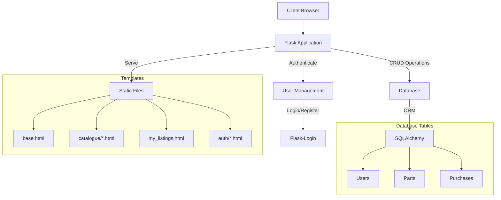

To fix the issues with your architecture.md file, I've made some adjustments to ensure the mermaid diagram and tree structure display correctly on GitHub Pages. Here's the corrected version:

---
title: Architecture
parent: Technical Docs
nav_order: 1
---

{: .label }
[Johann Estrada Pox & Tim Luhmann]

{: .no_toc }
# Architecture

<details open markdown="block">
  <summary>Table of contents</summary>
  {: .text-delta }
1. TOC
{:toc}
</details>

## Overview

PartWatch is a Flask-based web application that facilitates the buying and selling of automotive parts. It implements a B2C marketplace model where suppliers can list parts and customers can browse and purchase them. The application uses SQLAlchemy for database operations, WTForms for form handling, and Bootstrap for the frontend UI.



## Codemap

The application follows a typical Flask project structure:

```
PartWatch/
├── app.py                  # Application entry point
├── templates/             
│   ├── base.html          # Base template
│   ├── catalogue/         
│   │   ├── index.html     # Main catalogue view
│   │   └── view_part.html # Individual part view
│   ├── my_listings.html   # Supplier's parts management
│   └── auth/             
│       ├── login.html     
│       └── register.html  
├── static/               
│   ├── css/              
│   └── images/           
├── models/              
│   └── __init__.py       # Database models
└── forms/               
    └── __init__.py       # Form definitions
```

Key components:

- **Authentication**: Uses Flask-Login for session management with supplier/customer roles
- **Database**: SQLite with SQLAlchemy ORM for data persistence
- **Forms**: WTForms for input validation and CSRF protection
- **Templates**: Jinja2 templates with Bootstrap styling

## Cross-cutting concerns

### Authentication & Authorization

- Users must be logged in to access most features
- Role-based access control (supplier vs customer)
- Session management via Flask-Login

### Data Flow

- Parts listing: Suppliers create listings → stored in database → displayed in catalogue
- Purchases: Customer orders → update stock → create purchase record

### File Handling

- Part images are stored in static/images
- Filenames are sanitized for security

### Security

- CSRF protection on all forms
- Password hashing
- Input validation
- Secure file uploads