# UI components

The [Just the Docs documentation](https://just-the-docs.github.io/just-the-docs/docs/ui-components) details more UI components.

For a quick reference of the markdown syntax, visit [this page](https://github.com/just-the-docs/just-the-docs/blob/main/docs/index-test.md?plain=1).

## Images

```markdown
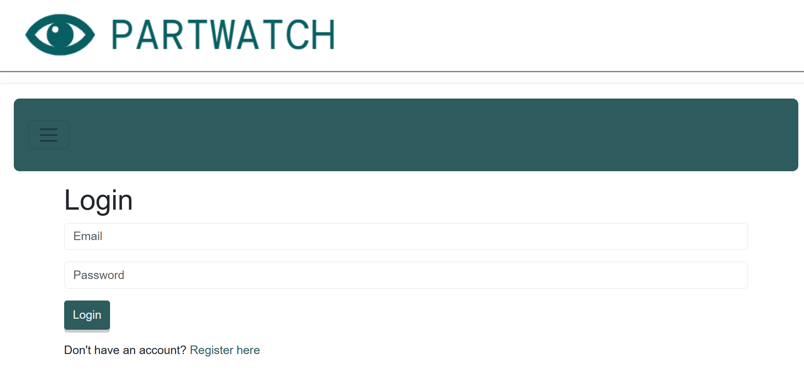
```


```markdown
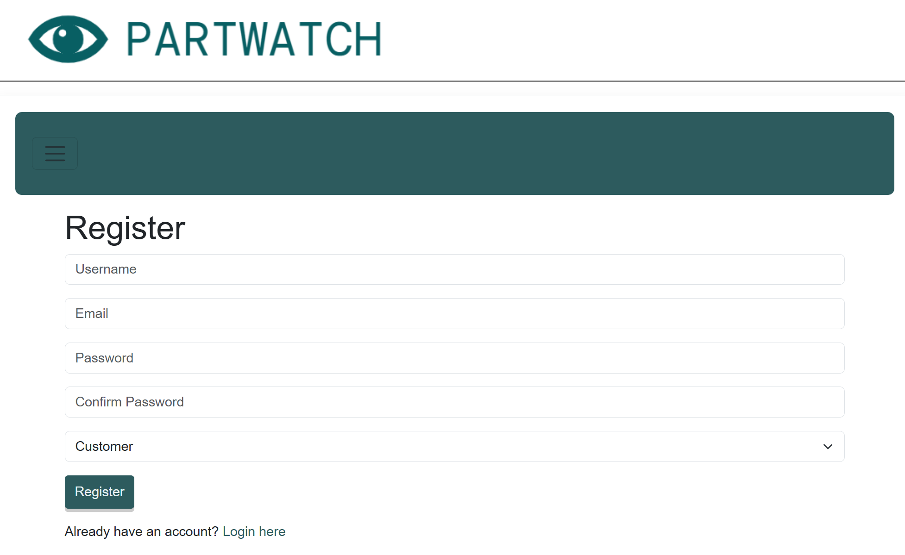
```


```markdown
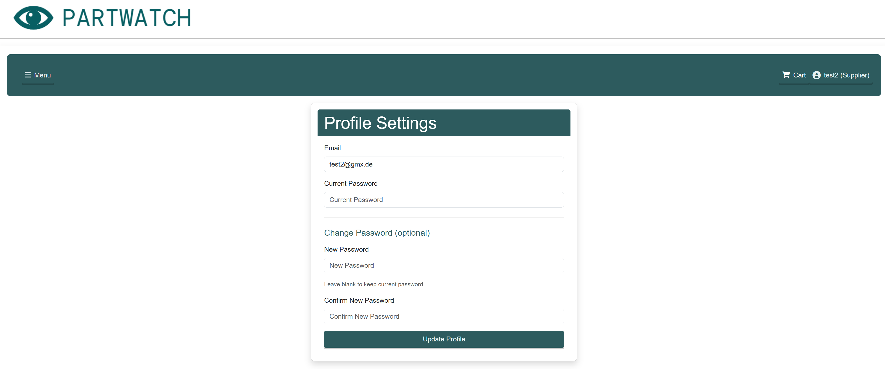
```


```markdown
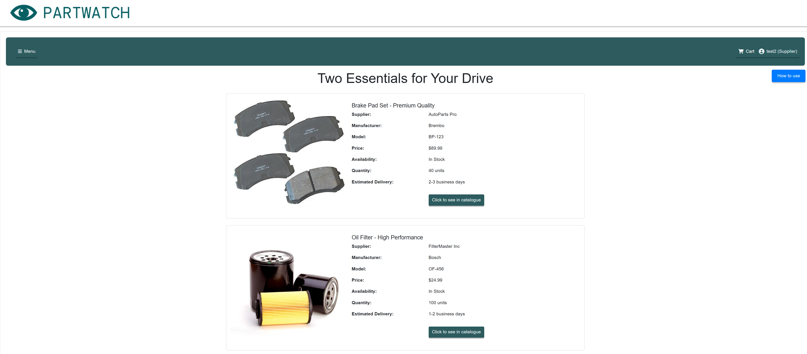
```


```markdown
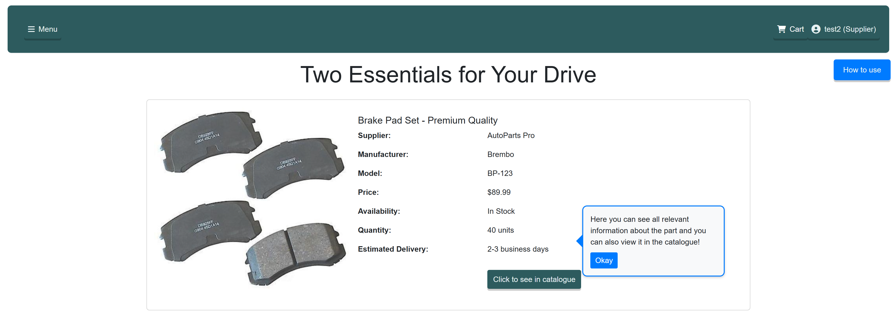
```


```markdown
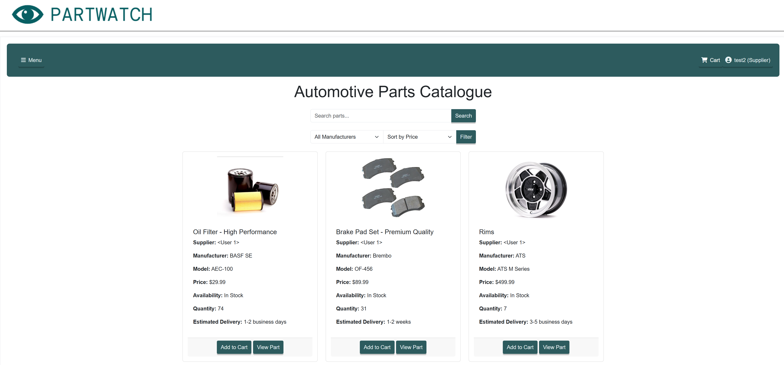
```


```markdown
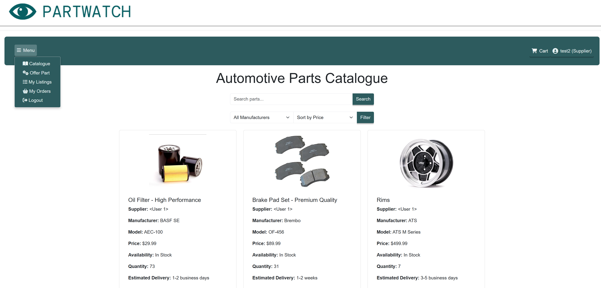
```


```markdown
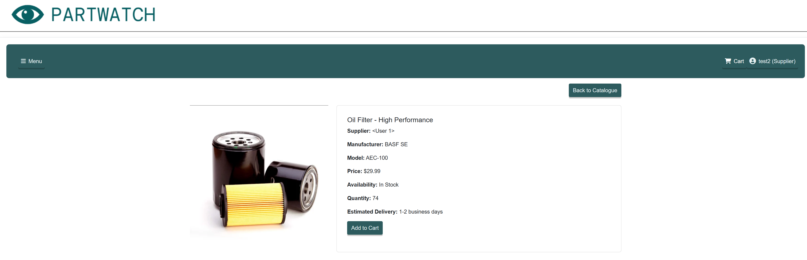
```


```markdown
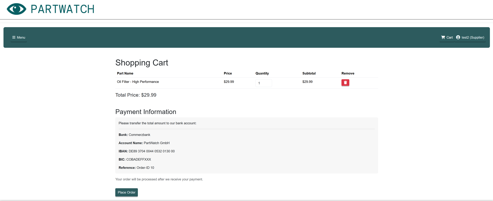
```


```markdown
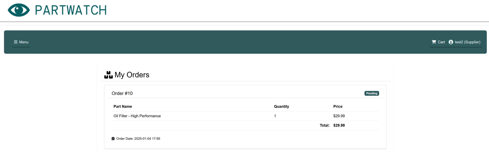
```


```markdown
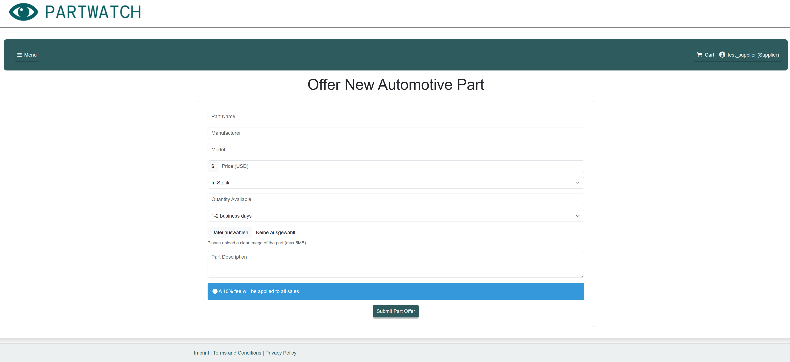
```


```markdown
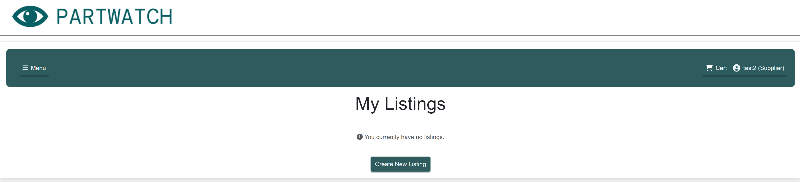
```


## Callouts

{: .info }
> This is an info callout.

{: .tip }
> This is a tip callout.

{: .attention }
> This is an attention callout.

{: .download }
> This is a download callout.

## Labels

{: .label }
[Default label]

{: .label .label-green }
[Green label]

{: .label .label-red }
[Red label]

## Mermaid.js

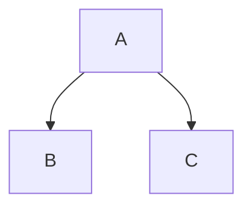

Visit the [Mermaid docs](https://mermaid.js.org/intro/) for a thorough description of the charting possibilities.